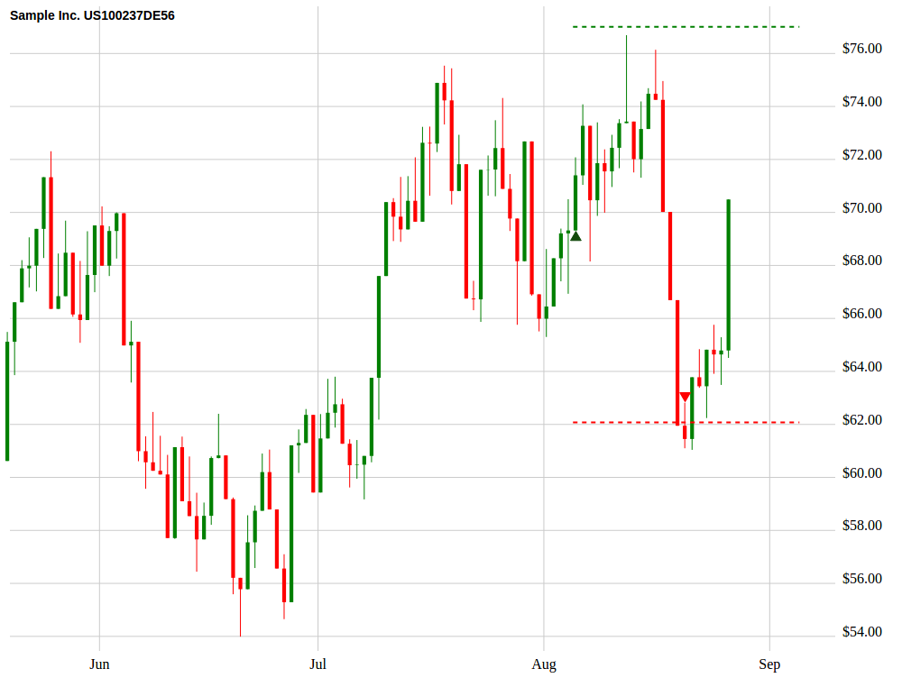

# Trade-Chart

Trade-Chart helps you to visualize your trading. Whether you want to visualize, show, optimize or improve your trading, Trade-Chart is for you!

# Table of Contents

- [Installation](#installation)
- [Basic Usage](#basic-usage)
- [License](#license)


## Installation

### Bower

```sh
bower install trade-chart --save
```

## Basic Usage

First create a Chart object and submit performances to them.
```sh
 var chart = new Chart("#chart", 1000, 750);

 chart.setData(Stock.Data);

 chart.build();

 chart.header(Stock.Name + " " + Stock.ISIN);

```
#### Example chart with a trade setup


## License

Trade-Chart is released under the MIT Licence. See the bundled LICENSE file for details.