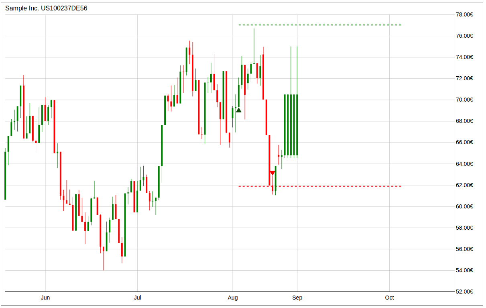

# Trade-Chart

Trade-Chart helps you to visualize your trading. Whether you want to visualize, show, optimize or improve your trading, Trade-Chart is for you!

# Table of Contents

- [Installation](#installation)
- [Basic Usage](#basic-usage)
- [License](#license)


## Installation

### Bower

```sh
bower install trade-chart --save
```

## Basic Usage

First create a ChartData object and submitt it to a Chart object.
```sh

var Data = new ChartData(Stock.Data);

Data.addSpace(50);

var options = {
    "currency": Stock.Currency,
    "type": "candlestick",
    "locale": 'en-US',
    "width": 1200,
    "height": 750,
};

var chart = new Chart("#chart", Data, options);

chart.draw();

chart.header(Stock.Name + " " + Stock.ISIN);

```
#### Example chart with a trade setup


## License

Trade-Chart is released under the MIT Licence. See the bundled LICENSE file for details.